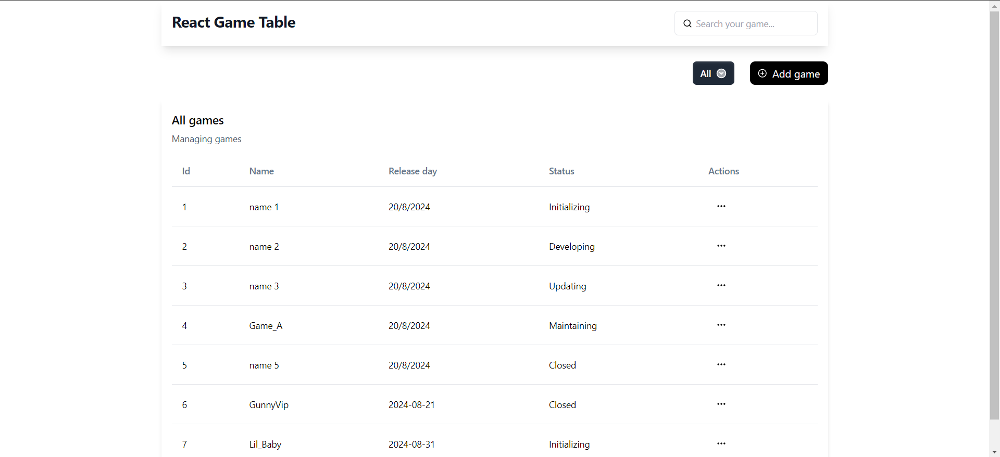

# React Game Table 
This is my personal work which used to demonstrate my ability to develope UI components

## Table of contents

- [React Game Table](#react-game-table)
  - [Table of contents](#table-of-contents)
  - [Overview](#overview)
    - [The challenge](#the-challenge)
    - [Requirements](#requirements)
    - [Screenshot](#screenshot)
    - [Links](#links)
  - [My process](#my-process)
    - [Built with](#built-with)
  - [Author](#author)

## Overview

### The challenge

Implementing a table component by using React

### Requirements

- The table should display Name, Release Date, Status of the game
- The app could add new game to existing table 
- The app could support deleting game entries
- The app could delete games
- The app should support filter and search features

### Screenshot

### Links
- Live Site URL: [game-table-gamma.vercel.app](game-table-gamma.vercel.app)

## My process
- Designing project folder
- Defining HTML structure
- Styling with TailwindCSS
- Handling input errors
- Integrating with Mock API Server
- Optimizing performance with React Hooks

### Built with

- HTML
- TailwindCSS
- HeadlessUI
- React Hook Form
- Zod
- Mock API
- Custom Hook

## Author

- Giang Tuan Hien